# 2026-03-07

```mermaid
    flowchart
    %% Top Level Objects
        eero
        ubiquiti1

    %% Draw Top Level Connections
        eero                        --- | Cat 7                             | ubiquiti1
        ubiquiti1                   --- | Cat 7                             | nas25-nic1
        ubiquiti1                   --- | Cat 7                             | pi-vpn-nic1

    %% Subgraphs
        subgraph pi-vpn [Raspberry Pi 5 <br> VPN EntryPoint]
            pi-vpn-nic1
            pi-vpn-ip2
            subgraph docker-pi-vpn [Docker Daemon]
                pi-vpn-docker-network
                pi-vpn-portainer-agent
                subgraph docker-pi-vpn-stack [ VPN Stack ]
                    adguard-dns
                    pi-vpn-ddns
                end
            end

        end

        %% Connections in pi-vpn
            pi-vpn-nic1             ---      |                               | pi-vpn-ip2
            pi-vpn-ip2              ---      |                               | pi-vpn-docker-network
            pi-vpn-docker-network   ----     | 9001                          | pi-vpn-portainer-agent
            pi-vpn-docker-network   ----     | TCP/UDP 53 for DNS            | adguard-dns
            pi-vpn-docker-network   ----     | TCP 443 for Managment         | adguard-dns
            pi-vpn-docker-network   ----     | N/A                           | pi-vpn-ddns

        subgraph nas25 [nas25.j-j.family]
        %% Assign Objects to nas25.j-j.family        
            nas25-nic1
            nas25-ip3
            nas25-ip4
            nas25-ip5
            nas25-webui
            subgraph docker-nas25 [Docker Daemon]
                portainer-server
                media-backend((App-Backend))
                subgraph proxy-stack
                    nas25-nginx
                end
                subgraph automated-media-stack
                    jellyfin
                    seerr
                    jellyfin
                    seerr
                    prowlarr
                    sabnzbd
                    sonarr
                    radarr
                    LazyLibrarian
                    qbittorrent
                end
            end
        end

        %% Draw Connections within nas25
            nas25-nic1          ---     |                                   | nas25-ip3 
            nas25-nic1          ---     |                                   | nas25-ip4
            nas25-ip4           ----    | TCP 443                           | portainer-server
            nas25-nic1          ---     |                                   | nas25-ip5
            media-backend       ---     | TCP 81 <br> Management            | nas25-nginx
            nas25-ip5           ---     | TCP 80/443 <br> Host Resolution   | nas25-nginx
            media-backend       ---     | TCP 30024 <br> Management         | qbittorrent
            media-backend       ---     | TCP 8096                          | jellyfin
            media-backend       ---     | TCP 5055                          | seerr
            media-backend       ---     | TCP 9696                          | prowlarr
            media-backend       ---     | TCP 9090                          | sabnzbd
            media-backend       ---     | TCP 8989                          | sonarr
            media-backend       ---     | TCP 7878                          | radarr
            media-backend       ---     | TCP 5299                          | LazyLibrarian
            nas25-ip3           ---     | TCP 443                           | nas25-webui
            nas25-ip5           ----    |                                         | media-backend


            nas25-ip5           ----    | TCP/UDP 51413 <br> Torrent Stream | qbittorrent

    %% Label Objects
        eero((                              eero <br> Router                        ))
        ubiquiti1{{                         unmanaged switch <br> 2.5 gb            }}

        nas25-nic1{{                        enp5s0                                  }}
        nas25-ip3{                          192.168.4.3                             }
        nas25-ip4{                          192.168.4.4                             }
        nas25-ip5{                          192.168.4.5                             }
        nas25-nginx[                        NGINX Proxy Manager                     ]
        pi-vpn-nic1{{                       eth0                                    }}
        pi-vpn-ip2{                         192.168.4.2                             }
        pi-vpn-docker-network((             Default <br> Docker <br> Network        ))
        pi-vpn-ddns[                        DDNS updater                            ]
        pi-vpn-portainer-agent[             Portainer Agent                         ]
        adguard-dns[                        ADGuardHome                             ]
        portainer-server[                   WebUI for Portainer                     ]
        nas25-webui[                        WebUI for nas25                         ]


```

## Notes:

- Ports listed are the exposed or open ports
- Lines represent IP layer connectivity
- Lines do not necessarily guarantee routes
- Hexagons are Physical Connections
- Circles represent subnet translation points