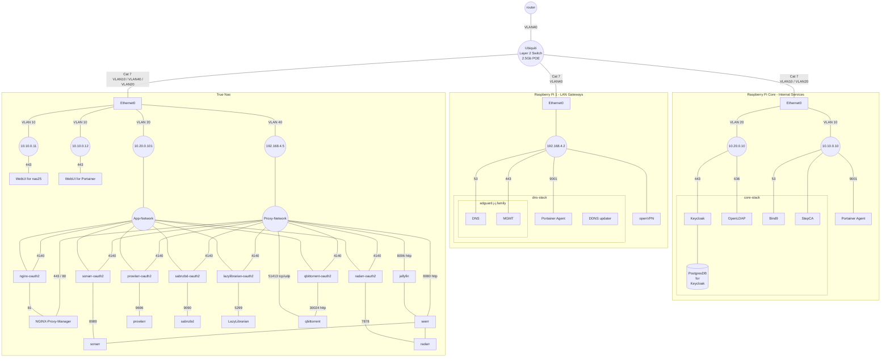

# VLAN Incorporation
# Far Future

```mermaid
  flowchart TD
    eero((router)) ---- | VLAN40 | Ubiquiti1((Ubiquiti <br> Layer 2 Switch <br> 2.5Gb POE))
    Ubiquiti1 --- | Cat 7 <br> VLAN40 | pi-1-nic[Ethernet0]
    Ubiquiti1 --- | Cat 7 <br> VLAN10 / VLAN40 / VLAN20 | tn-nic[Ethernet0]
    Ubiquiti1 --- | Cat 7 <br> VLAN10 / VLAN20 | pi-core-nic[Ethernet0]
    subgraph pi-1 [Raspberry Pi 1 - LAN Gateways]
      pi-1-ip1((192.168.4.2))
      pi-1-nic ----  pi-1-ip1
      pi-1-ip1 ---- | 53 | adguard-dns[DNS]
      pi-1-ip1 ---- | 443 | dns-management[MGMT]
      pi-1-ip1 ---- | 9001 | pi-1-portainer-agent
      pi-1-ip1 ---- openVPN
      subgraph dns-stack
        subgraph adguard.j-j.family
          adguard-dns
          dns-management
        end
        ddns[DDNS updater]
        pi-1-portainer-agent[Portainer Agent]
      end
    end
    subgraph pi-core [Raspberry Pi Core - Internal Services]
      pi-core-ip1((10.10.0.10))
      pi-core-ip2((10.20.0.10))
      pi-core-nic ---- | VLAN 10 | pi-core-ip1
      pi-core-nic ---- | VLAN 20 | pi-core-ip2
      subgraph core-stack
        ddns[DDNS updater]
      end
      pi-core-portainer-agent[Portainer Agent]
      pi-core-ip2 ---- |443| Keycloak
      pi-core-ip2 ---- |636| OpenLDAP
      pi-core-ip1 ---- |53| Bind9
      pi-core-ip1 ---- StepCA
      pi-core-ip1 ---- |9001| pi-core-portainer-agent
      subgraph core-stack
        Bind9
        StepCA
        Keycloak --- pg-keycloak[(PostgresDB <br> for <br> Keycloak)]
        OpenLDAP
      end
    end
    subgraph True Nas
      tn-nic ---- | VLAN 10 | ip1 
      tn-nic ---- | VLAN 10 | ip2
      tn-nic ---- | VLAN 40 | ip3
      tn-nic ---- | VLAN 20 |ip4
      ip1((10.10.0.11)) --- | 443 | Nas[WebUI for nas25]
      ip2((10.10.0.12)) --- | 443 | portainer[WebUI for Portainer]
      ip4((10.20.0.101)) ---- tn-backend((App-Network)) 
      ip3((192.168.4.5)) ---- tn-proxynet((Proxy-Network)) 
      nginx[NGINX-Proxy-Manager]
      tn-proxynet --- | 443 / 80 | nginx
      tn-proxynet --- | 8096 http| jellyfin
      tn-proxynet --- | 8080 http| seerr
      tn-proxynet --- | 4140 | prowlarr-oauth2
      tn-proxynet --- | 4140 | sabnzbd-oauth2
      tn-proxynet --- | 4140 | sonarr-oauth2
      tn-proxynet --- | 4140 | radarr-oauth2
      tn-proxynet --- | 4140 | lazylibrarian-oauth2
      tn-proxynet --- | 4140 | qbittorrent-oauth2
      tn-backend --- | 4140 | nginx-oauth2 
      nginx-oauth2 --- | 81 | nginx
      tn-backend --- prowlarr-oauth2
      tn-backend --- sabnzbd-oauth2
      tn-backend --- sonarr-oauth2
      tn-backend --- radarr-oauth2
      tn-backend --- lazylibrarian-oauth2
      tn-backend --- qbittorrent-oauth2
      tn-backend --- nginx-oauth2
      jellyfin
      seerr
      jellyfin --- seerr
      seerr --- sonarr
      seerr --- radarr
      prowlarr-oauth2 --- |9696| prowlarr
      sabnzbd-oauth2 --- |9090| sabnzbd
      sonarr-oauth2 --- |8989| sonarr
      radarr-oauth2 --- |7878| radarr
      lazylibrarian-oauth2 --- |5299| LazyLibrarian
      qbittorrent-oauth2 --- |30024 http| qbittorrent
      tn-proxynet ---- | 51413 tcp/udp | qbittorrent
    end
```